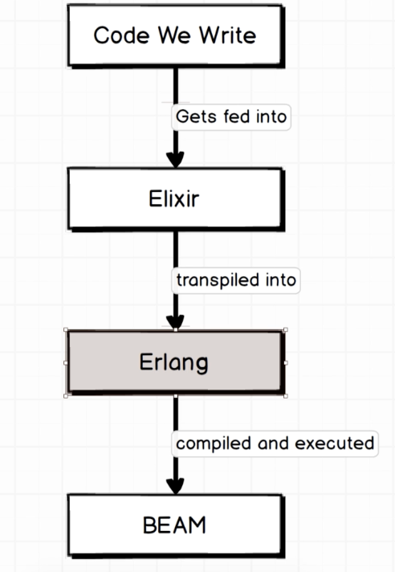

# 18
- 자바스크립트, 루비 같은 언어에서 특정 인덱스에 접근하는 것처럼 `Cards.deal(deck, 2)[0]` 이렇게 쓰면 에러 발생한다.
  - 이걸 해결하려면 패턴 매칭을 알아야한다.
- 패턴 매칭(Pattern Matching)
  - 엘릭서의 핵심
  - 엘릭서의 변수 할당 대체제
    - (= 엘릭서에서 변수 할당에 사용된다)
  - `deck = Cards.create_deck` 이것 또한 일종의 패턴 매칭이다.

        ```elixir
        iex(37)> { hand, rest_of_deck } = Cards.deal(deck, 5)
        {["Ace of Spades", "Two of Spades", "Three of Spades", "Four of Spades",
        "Five of Spades"],
        ["Ace of Clubs", "Two of Clubs", "Three of Clubs", "Four of Clubs",
        "Five of Clubs", "Ace of Hearts", "Two of Hearts", "Three of Hearts",
        "Four of Hearts", "Five of Hearts", "Ace of Diamonds", "Two of Diamonds",
        "Three of Diamonds", "Four of Diamonds", "Five of Diamonds"]}
        iex(38)> hand
        ["Ace of Spades", "Two of Spades", "Three of Spades", "Four of Spades",
        "Five of Spades"]
        iex(39)> rest_of_deck
        ["Ace of Clubs", "Two of Clubs", "Three of Clubs", "Four of Clubs",
        "Five of Clubs", "Ace of Hearts", "Two of Hearts", "Three of Hearts",
        "Four of Hearts", "Five of Hearts", "Ace of Diamonds", "Two of Diamonds",
        "Three of Diamonds", "Four of Diamonds", "Five of Diamonds"]
        ```
  - 등호(`=`)를 쓰면 패턴 매칭 시퀀스가 시작된다.
    - 왼쪽과 오른쪽이 같은 데이터 구조를 갖는다.
      - ex) `{ hand, rest_of_deck } = Cards.deal(deck, 5)`
        - 튜플에 동일한 수의 요소가 있다.
      - 패턴 매칭이라는 단어를 이해해보자
        - 왼쪽에 두 개의 변수를 배치해서 오른쪽 값의 구조와 일치시키려고 한다.
    - 등호(`=`)를 쓰기만 하면 뭔가를 반환하지 않더라도 패턴 매칭 시퀀스가 시작된다.
- 연습
  - `color1 = ["red"]`
  - `[color1] = ["red"]`
  - `[color1, color2] = ["red", "blue"]`
  - `[color1, color2, color3] = ["red", "blue"]`

# 19
- 파일시스템에 저장하기
  - 저장 기능의 목적
    - 사용자에게 쓰기 기능을 제공하는 것
- 파일시스템 라이브러리가 표준 라이브러리의 일부이기 때문에 별도 import 없이 바로 작업을 시작할 수 있다.
- 엘릭서 생태계
  - 사실 우리가 작성하는 모든 코드는 엘릭서 코드로 실행되지도 않는다. 몇 단계를 거쳐서 실행된다.
  - Erlang
    - 수년 전에 개발된, 엘릭서와는 완전히 별개의 프로그래밍 언어다.
    - 엘릭서와 구문 스타일은 다르지만 기본적으로 거의 동일하다. 엘릭서를 이 언어의 방언으로 생각할 수 있다.
    - 구문이 매우 이해하기 어려운 것으로 유명하다.
  - BEAM
    - 모든 Erlang 코드가 실행되는 가상머신
    - ex) 자바의 JVM
  - Code We Write -> Elixir Runtime -> Erlang Runtime -> BEAM (Compile and Execute)
  - 여기서 알아야하는 건 엘릭서가 구현하지 않는 작은 기능, 시스템에서 작동하는 일부 영역이 있다는 것이다.
    - 엘릭서로 작성한 작업을 수행하기 위해 어느 정도의 Erlang 코드를 호출해야 한다.
      - (= 엘릭서 표준 라이브러리로 작업한다.)



# 20
- 현재 Deck을 파일시스템에 저장하고 싶다.
- Erlang 코드를 직접적으로 호출할 수 있다.
  - `:erlang`
    - 이 erlang 객체는 엄청난 수의 내장 메서드를 가지고 있다.

# 21
- 파일시스템에서에 저장한 현재 Deck 불러오고 싶다.

    ```elixir
    iex(1)> File.read("my_deck")
    {:ok,
    <<131, 108, 0, 0, 0, 20, 109, 0, 0, 0, 13, 65, 99, 101, 32, 111, 102, 32, 83,
    112, 97, 100, 101, 115, 109, 0, 0, 0, 13, 84, 119, 111, 32, 111, 102, 32, 83,
    112, 97, 100, 101, 115, 109, 0, 0, 0, 15, 84, ...>>}
    ```

    ```elixir
    iex(3)> { status, binary } = File.read("my_deck")
    {:ok,
    <<131, 108, 0, 0, 0, 20, 109, 0, 0, 0, 13, 65, 99, 101, 32, 111, 102, 32, 83,
    112, 97, 100, 101, 115, 109, 0, 0, 0, 13, 84, 119, 111, 32, 111, 102, 32, 83,
    112, 97, 100, 101, 115, 109, 0, 0, 0, 15, 84, ...>>}
    iex(4)> :erlang.binary_to_term(binary)          
    ["Ace of Spades", "Two of Spades", "Three of Spades", "Four of Spades",
    "Five of Spades", "Ace of Clubs", "Two of Clubs", "Three of Clubs",
    "Four of Clubs", "Five of Clubs", "Ace of Hearts", "Two of Hearts",
    "Three of Hearts", "Four of Hearts", "Five of Hearts", "Ace of Diamonds",
    "Two of Diamonds", "Three of Diamonds", "Four of Diamonds", "Five of Diamonds"]
    ```

    ```elixir
    iex(6)> Cards.load("my_deck")
    ["Ace of Spades", "Two of Spades", "Three of Spades", "Four of Spades",
    "Five of Spades", "Ace of Clubs", "Two of Clubs", "Three of Clubs",
    "Four of Clubs", "Five of Clubs", "Ace of Hearts", "Two of Hearts",
    "Three of Hearts", "Four of Hearts", "Five of Hearts", "Ace of Diamonds",
    "Two of Diamonds", "Three of Diamonds", "Four of Diamonds", "Five of Diamonds"]
    ```

- 존재하지 않는 파일을 불러오려고 할 때 발생하는 에러
  - `enoent`

    ```elixir
    iex(7)> File.read("asdfasdf")
    {:error, :enoent}

    iex(8)> File.read("my_deck") 
    {:ok,
    <<131, 108, 0, 0, 0, 20, 109, 0, 0, 0, 13, 65, 99, 101, 32, 111, 102, 32, 83,
    112, 97, 100, 101, 115, 109, 0, 0, 0, 13, 84, 119, 111, 32, 111, 102, 32, 83,
    112, 97, 100, 101, 115, 109, 0, 0, 0, 15, 84, ...>>}
    ```

- 가능하다면 엘릭서에서는 if문을 작성하지 않는다.
  - case문을 작성한다.
  - 엘릭서에서 case문은 패턴 매칭 + if문이다.

# 22
- atom(= symbol)
  - 상태코드 또는 메시지, 제어 처리와 같은 종류의 처리로 엘릭서 전체에서 사용된다.
  - 루비에서 atom이라는 단어를 쓰기때문에 엘릭서에서는 symbol이라고 하기도 한다.
  - ex)
    - `:ok`
    - `:error`
- 원자는 정확히 문자열과 같다고 생각하면 된다.
  - 원자와 문자열 둘의 차이점은 일정량의 원자(사용자에게 표시될 수 있는 정보)를 모으는 데 문자열이 사용된다는 거다.

- 패턴 매칭 연습
  - `["red", color] = ["red", "blue"]` (성공)
  - `["red", color] = ["green", "blue"]` (에러)
    - 왼쪽에 하드코딩된 값을 넣으면 오른쪽 같은 지점에 동일한 값을 갖도록 요구한다.

# 23
- 기본적으로 create deck, shuffle deck, create hand 작업을 연속으로 한다.
  - 어차피 반복되는 작업이니까 메서드 하나하나 호출하지 않고 간편하게 처리하고 싶다.
    - 이런 처리를 할 땐 파이프 연산자를 써서 간단하게 메서드 호출 체인을 형성할 수 있다.

# 24
- 파이프 연산자가 올바르게 자동하도록 코드 작성하기
  - 일관된 첫 번째 인수를 사용하는 메서드를 작성한다.

# 25
- 다른 개발자들을 위해 문서 추가하기
  - `ex_doc` 패키지
- 첫째줄이 `defmodule Cards.Mixfile do` 이런식으로 시작하는 파일을 믹스파일, 즉 혼합파일이라고 한다.
- 혼합파일에는 프로젝트에 대한 정보가 있다.
- 혼합파일 맨 아래에는 `deps`라는 함수가 있다.
  - 패키지 종속성을 관리한다.
  - 첫 번째 인수: 패키지 이름
  - 두 번째 인수: 패키지 버전
- `mix deps.get`
